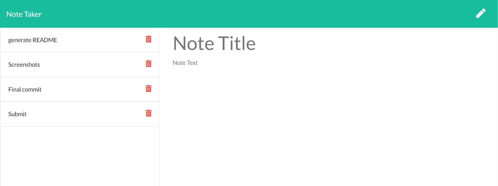
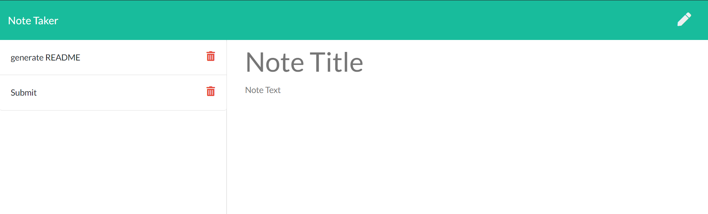

# Note Taker

  

## Description
An applicaiton that can be used to write and save notes. This application will save and rerieve note data from a json file

## Table of Contents

- [Installation](#installation)
- [Usage](#usage)
- [Contributions](#contributions)
- [Testing](#testing)
- [License](#license)
- [Questions](#questions)
- [Screenshots](#screenshots)
- [Links](#links)

## Installation
Clone the repo and and run the server

## Usage
WHEN you open the Note Taker, THEN you are presented with a landing page with a link to a notes page, WHEN you click on the link to the notes page, THEN you are presented with a page with existing notes listed in the left-hand column, plus empty fields to enter a new note title and the note’s text in the right-hand column, WHEN you enter a new note title and the note’s text, THEN a Save icon appears in the navigation at the top of the page, WHEN you click on the Save icon, THEN the new note I have entered is saved and appears in the left-hand column with the other existing notes, WHEN you click on an existing note in the list in the left-hand column, THEN that note appears in the right-hand column, WHEN you click on the Write icon in the navigation at the top of the page, THEN you are presented with empty fields to enter a new note title and the note’s text in the right-hand column

## Contributions
Contributions are welcome, contact me on the below

## Testing
no test suite written

## License
**https://opensource.org/licenses/MIT**

## Questions
My github username is: TBR2000 and the repository for this project is: Note-Taker

If you have any questions please contact me at: timothyrabbidge@live.com.au

## Screenshots
Screenshot of the deployed project:

## Links 
Links to the deployed project and Github Repository

Repository: **https://github.com/TBR2000/Note-Taker**

Deployed Project: **https://hidden-mesa-93482.herokuapp.com/**
